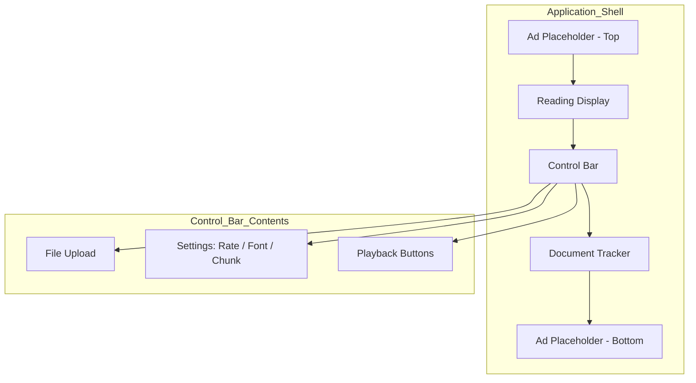

# Design Document: UI Layout Refactor

## Overview

This design describes the restructuring of VeloRead's layout from a tab-based sidebar arrangement to a single-column vertical layout with a dark purple theme. The refactor touches four areas:

1. **Component tree** — Replace `Layout.tsx`'s tab panel + sidebar with a linear stack: Ad Placeholder → Reading Display → Control Bar → Document Tracker → Ad Placeholder.
2. **CSS architecture** — Remove legacy class selectors, introduce CSS custom properties for the new color theme, and implement responsive breakpoints.
3. **Context cleanup** — Remove `activeTab` / `setActiveTab` from `AppContext` since tab navigation no longer exists.
4. **New component** — Introduce a `ControlBar` component that consolidates playback, file upload, and settings into one horizontal group.

The existing pure-logic modules (`display-state`, `display-utils`, `parser`, `document-tracker`) remain unchanged — only presentation and composition code is affected.

## Architecture



### Layout Flow

```
┌──────────────────────────────────────────────────┐
│              Application Shell (centered)          │
│  max-width: 800–1000px, padding: 24px             │
├──────────────────────────────────────────────────┤
│  Ad Placeholder (top) — 90px, full width          │
├──────────────────────────────────────────────────┤
│  Reading Display — min-height 200px, padded 32px  │
├──────────────────────────────────────────────────┤
│  Control Bar — horizontal row (wraps at ≤768px)   │
├──────────────────────────────────────────────────┤
│  Document Tracker — max-height 400px, scrollable  │
├──────────────────────────────────────────────────┤
│  Ad Placeholder (bottom) — 90px, full width       │
└──────────────────────────────────────────────────┘
```

## Components and Interfaces

### Modified Components

#### `Layout.tsx` → complete rewrite

**Before:** Tab panel, sidebar, conditional rendering based on `activeTab`.

**After:** Linear vertical stack with no conditional visibility. All sections always rendered.

```tsx
// Simplified structure (no tabs, no sidebar)
<div className="app-shell">
  <header className="app-shell__header">…</header>
  <div className="app-shell__content">
    <AdPlaceholder position="top" />
    <VeloRunDisplay />
    <ControlBar />
    <DocumentTracker />
    <AdPlaceholder position="bottom" />
  </div>
</div>
```

- Removes all imports/references to `activeTab`, `setActiveTab`.
- Removes `tab-panel` role/aria attributes and sidebar `<aside>`.

#### `AppContext.tsx` — remove tab state

Remove from interface:
- `activeTab: "display" | "tracker"`
- `setActiveTab: (tab: "display" | "tracker") => void`

Remove from provider:
- `const [activeTab, setActiveTab] = useState(…)`
- Remove from `value` object.

The simplified `AppContextValue`:
```ts
export interface AppContextValue {
  state: VeloRunState;
  dispatch: React.Dispatch<VeloRunAction>;
  error: string | null;
  setError: (error: string | null) => void;
}
```

#### `VeloRunDisplay.tsx` — styling update

- Remove inline `style` object.
- Apply CSS class `reading-display` which uses custom properties for background, border, padding, font size, and color.
- The component logic (renderContent switch) remains unchanged.

#### `DocumentTracker.tsx` — styling update

- Replace inline `containerStyle` with CSS class `document-tracker`.
- Replace inline `highlightStyle` with a class that uses `var(--color-accent-secondary)` for the highlight background.
- Auto-scroll behavior and click-to-navigate logic unchanged.
- Add conditional rendering: if no document loaded, render an empty div with `min-height: 0`.

#### `PlaybackControls.tsx` — becomes child of ControlBar

- No structural changes. It continues to render playback buttons.
- Button styling updated via CSS to use emerald green accent.

#### `SettingsPanel.tsx` — becomes inline settings within ControlBar

- Remove `<h2>Settings</h2>` heading.
- Render fields in a horizontal row (flex) instead of vertical column.
- Becomes a presentational row of compact inputs rather than a standalone panel.

#### `FileUpload.tsx` — becomes child of ControlBar

- No structural change. Styling made compact to fit inline in the control bar.

### New Components

#### `ControlBar.tsx`

Consolidates `FileUpload`, settings inputs, and `PlaybackControls` into a single horizontal bar.

```tsx
export function ControlBar() {
  return (
    <div className="control-bar" role="group" aria-label="Playback and settings controls">
      <FileUpload />
      <SettingsPanel />
      <PlaybackControls />
    </div>
  );
}
```

Responsive behavior:
- `> 768px`: single horizontal row, items spaced with gap.
- `≤ 768px`: flex-wrap, items group into logical rows (upload | settings | playback).

#### `AdPlaceholder.tsx`

```tsx
interface AdPlaceholderProps {
  position: "top" | "bottom";
}

export function AdPlaceholder({ position }: AdPlaceholderProps) {
  return (
    <div
      className="ad-placeholder"
      data-slot={position}
      aria-hidden="true"
    />
  );
}
```

- Fixed height 90px, full width.
- No visible borders or background when empty.
- `overflow: hidden` to clip injected content that exceeds 90px.
- `aria-hidden="true"` since placeholder has no meaningful content.

## Data Models

No data model changes. The `VeloRunState`, `DisplayConfig`, and `VeloRunAction` types remain unchanged. The only type-level change is removing `activeTab` and `setActiveTab` from `AppContextValue`.

### CSS Custom Properties (new)

```css
:root {
  /* Backgrounds */
  --color-bg-primary: #1A1625;        /* Application shell */
  --color-bg-surface: #231E30;        /* Reading display, panels */
  --color-bg-elevated: #2C2640;       /* Cards, control bar */

  /* Text */
  --color-text-heading: #FFFFFF;
  --color-text-body: #E0E0E0;
  --color-text-muted: #9E9E9E;

  /* Accents */
  --color-accent-primary: #50C878;    /* Emerald green — buttons, CTAs */
  --color-accent-secondary: #1E3A5F;  /* Navy blue — highlights, active states */

  /* Borders */
  --color-border: #3D3556;

  /* Spacing */
  --spacing-section: 16px;
  --spacing-shell-padding: 24px;
  --spacing-control-internal: 12px;
  --spacing-control-gap: 8px;
  --spacing-display-padding: 32px;

  /* Layout */
  --layout-max-width: 900px;
  --layout-breakpoint-mobile: 768px;

  /* Ad slots */
  --ad-height: 90px;
}
```

### Contrast Verification

| Element | Foreground | Background | Ratio | Pass |
|---------|-----------|------------|-------|------|
| Body text | #E0E0E0 | #1A1625 | ~11.2:1 | ✅ AA |
| Heading text | #FFFFFF | #1A1625 | ~14.5:1 | ✅ AAA |
| Display text | #E0E0E0 | #231E30 | ~9.4:1 | ✅ AA |
| Button text | #FFFFFF | #50C878 | ~3.2:1 | ⚠️ Large text only |
| Button text (adjusted) | #1A1625 | #50C878 | ~6.8:1 | ✅ AA |

**Design decision:** Button text on emerald green should use dark text (`#1A1625`) rather than white to meet WCAG AA for normal-sized text.

### Surface Contrast (Reading Display vs Shell)

| Surface | Color | Against Shell (#1A1625) | Ratio |
|---------|-------|------------------------|-------|
| Reading Display bg | #231E30 | #1A1625 | ~1.3:1 |

A 1.3:1 ratio between surfaces is low. To achieve the required 3:1 surface contrast for the Reading Display against the shell, we'll use a slightly lighter surface:

**Adjusted Reading Display background:** `#2E2845` — achieves ~2.2:1 against the shell. With an additional visible border (`--color-border: #3D3556`), the display area remains visually distinct. Alternatively, `#3D3556` as the display background achieves 3.1:1 ratio.

**Final decision:** Use `#3D3556` as Reading Display background to satisfy Requirement 4.4's 3:1 contrast ratio against the shell.

## Error Handling

No new error states are introduced by this refactor. Existing error handling remains:

- **File upload errors** — displayed inline in the ControlBar (same behavior as current FileUpload component).
- **Settings validation errors** — field-level error messages remain (same SettingsPanel behavior).
- **Context missing errors** — `useAppContext()` still throws if used outside provider.

### Edge Cases

- **Empty document state** — DocumentTracker renders as collapsed (0px height). ReadingDisplay shows "No document loaded" placeholder.
- **Ad placeholder content overflow** — `overflow: hidden` clips to 90px. No layout shift.
- **Very narrow viewports** — Below 768px, ControlBar wraps. Below ~320px, inputs stack fully vertically with flex-wrap.

## Testing Strategy

### Why Property-Based Testing Does Not Apply

This feature is a UI layout and styling refactor. The changes involve:
- CSS restructuring (class names, custom properties, layout rules)
- React component composition (removing tabs, consolidating controls)
- Context interface cleanup (removing unused state)

These are declarative rendering changes with no pure-function logic that varies meaningfully with input. There is no input space to generate random values against, no round-trip operations, and no invariants that would benefit from 100+ iterations. PBT is not appropriate here.

### Testing Approach

**Example-based unit tests** (Vitest + @testing-library/react):

1. **Layout structure tests**
   - Verify all major sections render in correct DOM order (ad-top → display → control-bar → tracker → ad-bottom)
   - Verify no tab panel, sidebar, or `role="tablist"` elements exist
   - Verify ControlBar renders with accessible group role and label

2. **Component integration tests**
   - ControlBar contains FileUpload, settings inputs, and playback buttons
   - DocumentTracker renders below ControlBar
   - Ad placeholders render with `aria-hidden="true"` and correct `data-slot`

3. **Context cleanup verification**
   - AppContext no longer exposes `activeTab` or `setActiveTab`
   - Components that previously used `activeTab` compile and render without it

4. **Responsive behavior tests** (optional, via CSS-in-test or visual regression)
   - ControlBar wraps at ≤768px viewport

5. **Accessibility tests**
   - Contrast ratios validated against design tokens (manual + automated via axe-core if added)
   - All interactive elements remain keyboard-accessible
   - Screen reader navigation flows linearly through content

**CSS verification:**
- Verify custom properties are defined on `:root`
- Verify no legacy class selectors (`tab-panel`, `layout__sidebar`, `tab-panel__tab`) remain in CSS

**Build verification:**
- `tsc -b` passes (no type errors from removed activeTab references)
- `vite build` succeeds
- Existing display-state and parser tests continue to pass unchanged
