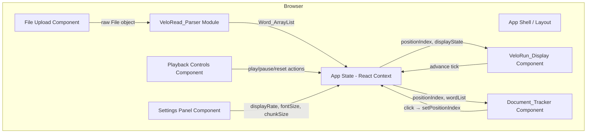
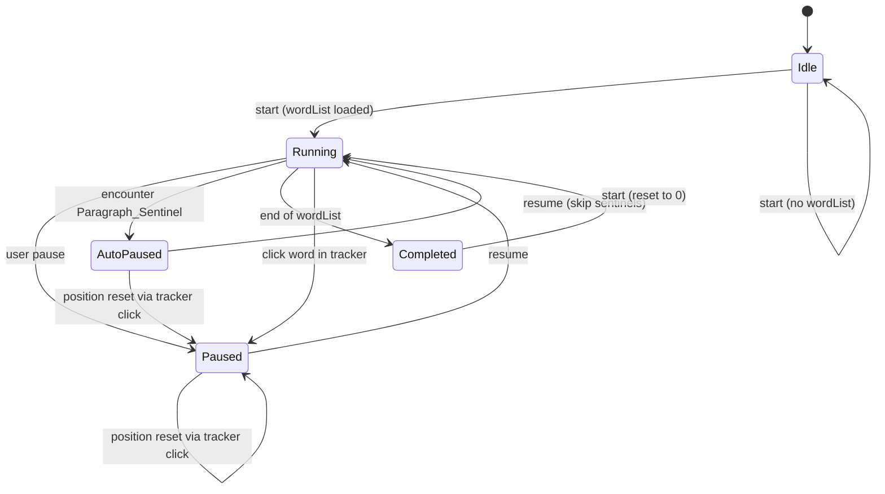

# Design Document: VeloRead Speed Reader

## Overview

VeloRead is a client-side speed reading Single Page Application built with React, TypeScript, and Vite. It enables users to upload text documents (.txt, .md, .rtf), parse them into a sequential word structure, and display words one at a time at a configurable rate. The application operates entirely in the browser with no backend dependencies.

The system is composed of three core modules:
1. **VeloRead_Parser** — File validation, text parsing, and Word_ArrayList construction
2. **VeloRun_Display** — Timed word display engine with play/pause/auto-pause state machine
3. **Document_Tracker** — Interactive full-text view with position-synced highlighting

All state is ephemeral (in-memory only). No persistence layer is required.

## Architecture

### High-Level System Diagram



### State Machine: Display Runner



### Design Decisions

| Decision | Rationale |
|----------|-----------|
| React Context + useReducer for state | Simple SPA with moderate state; avoids external dependency (Redux/Zustand) while keeping state predictable |
| `setInterval` with dynamic interval recalculation | Display rate changes mid-run require clearing and re-creating the interval. `setInterval` is simpler than `requestAnimationFrame` for fixed-cadence display |
| Single Word_ArrayList per document | Memory efficiency — position changes are O(1) index updates, no array cloning |
| Paragraph_Sentinel as a unique Symbol | Prevents collision with actual word content; type-safe discrimination via TypeScript union types |
| Pure parsing module (no React dependency) | Enables unit/property testing without DOM; easily composable |

## Components and Interfaces

### Module: `veloread-parser`

Responsible for file validation and text-to-WordArrayList conversion.

```typescript
// types.ts
export const PARAGRAPH_SENTINEL = Symbol("PARAGRAPH_SENTINEL");
export type ParagraphSentinel = typeof PARAGRAPH_SENTINEL;
export type WordEntry = string;
export type WordArrayItem = WordEntry | ParagraphSentinel;
export type WordArrayList = WordArrayItem[];

// parser.ts
export interface ParseResult {
  success: true;
  wordList: WordArrayList;
}

export interface ParseError {
  success: false;
  error: string;
}

export type ParseOutcome = ParseResult | ParseError;

/**
 * Validates file extension against allowed set.
 * @returns error message or null if valid.
 */
export function validateFileExtension(fileName: string): string | null;

/**
 * Validates file size does not exceed 10 MB.
 * @returns error message or null if valid.
 */
export function validateFileSize(fileSize: number): string | null;

/**
 * Parses raw text content into a WordArrayList.
 * - Splits on whitespace runs
 * - Inserts exactly one PARAGRAPH_SENTINEL per group of consecutive blank lines
 * - Preserves original word order
 * - Returns ParseError if no readable words are found
 */
export function parseText(content: string): ParseOutcome;

/**
 * Orchestrates file validation + parsing.
 * Reads File via FileReader, validates, then parses.
 */
export function processFile(file: File): Promise<ParseOutcome>;
```

### Module: `velorun-display` (State + Logic)

Core display engine implemented as a reducer + side-effect hook.

```typescript
// display-state.ts
export type DisplayState = "idle" | "running" | "paused" | "auto-paused" | "completed";

export interface DisplayConfig {
  displayRate: number;       // WPM, integer 1–1500, default 250
  fontSize: number;          // points, integer 8–72, default 36
  displayChunkSize: number;  // integer 1–5, default 1
}

export interface VeloRunState {
  wordList: WordArrayList | null;
  positionIndex: number;
  displayState: DisplayState;
  config: DisplayConfig;
}

export type VeloRunAction =
  | { type: "LOAD_DOCUMENT"; wordList: WordArrayList }
  | { type: "START" }
  | { type: "PAUSE" }
  | { type: "ADVANCE" }
  | { type: "SET_POSITION"; index: number }
  | { type: "SET_DISPLAY_RATE"; rate: number }
  | { type: "SET_FONT_SIZE"; size: number }
  | { type: "SET_CHUNK_SIZE"; size: number }
  | { type: "RESET" };

/**
 * Pure reducer — all state transitions are deterministic.
 * Handles sentinel skipping, boundary checks, auto-pause detection.
 */
export function veloRunReducer(state: VeloRunState, action: VeloRunAction): VeloRunState;

/**
 * Validates a display rate value.
 * @returns the validated integer or null if invalid.
 */
export function validateDisplayRate(value: unknown): number | null;

/**
 * Validates a font size value.
 * @returns the validated integer or null if invalid.
 */
export function validateFontSize(value: unknown): number | null;

/**
 * Validates a display chunk size value.
 * @returns the validated integer or null if invalid.
 */
export function validateChunkSize(value: unknown): number | null;

/**
 * Given current position and chunk size, returns the words to display.
 * Skips sentinels. Returns empty array if at sentinel (auto-pause case).
 */
export function getDisplayWords(
  wordList: WordArrayList,
  positionIndex: number,
  chunkSize: number
): string[];

/**
 * Computes the next position index after an advance.
 * Accounts for chunk size and detects sentinel encounters.
 * Returns { nextIndex, hitSentinel }.
 */
export function computeNextPosition(
  wordList: WordArrayList,
  currentIndex: number,
  chunkSize: number
): { nextIndex: number; hitSentinel: boolean };

/**
 * Given a position at a sentinel, advances past all consecutive sentinels.
 * Returns the index of the first non-sentinel item after the group.
 */
export function skipConsecutiveSentinels(
  wordList: WordArrayList,
  startIndex: number
): number;
```

### Module: `document-tracker`

Interactive full-text view with highlighting and click-to-seek.

```typescript
// document-tracker.ts

/**
 * Reconstructs display-friendly paragraphs from WordArrayList.
 * Each paragraph is an array of { word, globalIndex } objects.
 */
export function buildParagraphs(
  wordList: WordArrayList
): Array<Array<{ word: string; globalIndex: number }>>;

// React component props
export interface DocumentTrackerProps {
  wordList: WordArrayList;
  positionIndex: number;
  onWordClick: (index: number) => void;
}
```

### React Components Hierarchy

```
<App>
  <AppProvider>              // React Context provider
    <Layout>
      <FileUpload />         // drag-drop or file picker
      <TabPanel>
        <VeloRunDisplay />   // centered word display + controls
        <DocumentTracker />  // full text with highlighting
      </TabPanel>
      <SettingsPanel />      // WPM, font size, chunk size inputs
    </Layout>
  </AppProvider>
</App>
```

### Hook: `useDisplayRunner`

```typescript
/**
 * Custom hook that manages the setInterval lifecycle.
 * - Starts/stops interval based on displayState === "running"
 * - Dispatches ADVANCE action on each tick
 * - Recalculates interval when displayRate changes
 * - Cleans up interval on unmount
 */
export function useDisplayRunner(
  state: VeloRunState,
  dispatch: React.Dispatch<VeloRunAction>
): void;
```

## Data Models

### Word_ArrayList Structure

```typescript
// Example representation of parsed content:
// Original text:
//   "Hello world.\n\nNew paragraph here."
//
// Resulting WordArrayList:
//   ["Hello", "world.", Symbol(PARAGRAPH_SENTINEL), "New", "paragraph", "here."]

type WordArrayList = (string | typeof PARAGRAPH_SENTINEL)[];
```

### Application State Shape

```typescript
interface AppState {
  // Document state
  wordList: WordArrayList | null;
  fileName: string | null;

  // Display engine state
  positionIndex: number;
  displayState: DisplayState;  // "idle" | "running" | "paused" | "auto-paused" | "completed"

  // Configuration
  config: {
    displayRate: number;       // default 250 WPM
    fontSize: number;          // default 36pt
    displayChunkSize: number;  // default 1
  };

  // UI state
  error: string | null;
  activeTab: "display" | "tracker";
}
```

### Validation Boundaries

| Parameter | Type | Min | Max | Default |
|-----------|------|-----|-----|---------|
| Display Rate (WPM) | integer | 1 | 1500 | 250 |
| Font Size (pt) | integer | 8 | 72 | 36 |
| Display Chunk Size | integer | 1 | 5 | 1 |
| File Size | bytes | 1 | 10,485,760 (10 MB) | — |

### Allowed File Extensions

```typescript
const ALLOWED_EXTENSIONS = [".txt", ".md", ".rtf"] as const;
```


## Correctness Properties

*A property is a characteristic or behavior that should hold true across all valid executions of a system—essentially, a formal statement about what the system should do. Properties serve as the bridge between human-readable specifications and machine-verifiable correctness guarantees.*

### Property 1: File Extension Validation Partitions Correctly

*For any* file name string, `validateFileExtension` SHALL return null (valid) if and only if the file name ends with `.txt`, `.md`, or `.rtf` (case-insensitive), and SHALL return an error message for all other extensions.

**Validates: Requirements 1.1, 1.3**

### Property 2: File Size Validation Boundary

*For any* non-negative integer file size, `validateFileSize` SHALL return null (valid) if and only if the size is less than or equal to 10,485,760 bytes, and SHALL return an error message otherwise.

**Validates: Requirements 1.4**

### Property 3: Whitespace-Only Content Rejection

*For any* string composed entirely of whitespace characters (spaces, tabs, newlines, carriage returns), `parseText` SHALL return a ParseError indicating no readable content.

**Validates: Requirements 1.2, 2.5**

### Property 4: Parse Round-Trip Reconstruction

*For any* string containing at least one non-whitespace character, parsing with `parseText` and then reconstructing (joining non-sentinel entries with single spaces, replacing each sentinel with double-newline) SHALL produce text equal to the original after normalizing all whitespace runs to single spaces and all paragraph breaks (blank-line groups) to a single double-newline.

**Validates: Requirements 2.1, 2.2, 2.3, 2.4**

### Property 5: No Consecutive Sentinels in Parse Output

*For any* input text, the resulting Word_ArrayList from `parseText` SHALL never contain two or more consecutive Paragraph_Sentinel values adjacent to each other.

**Validates: Requirements 2.2**

### Property 6: Chunk Size Validation

*For any* value, `validateChunkSize` SHALL return the value unchanged if it is an integer in the range [1, 5], and SHALL return null for all other values.

**Validates: Requirements 3.5, 3.6**

### Property 7: Display Rate Validation

*For any* value, `validateDisplayRate` SHALL return the value unchanged if it is an integer in the range [1, 1500], and SHALL return null for all other values.

**Validates: Requirements 4.2, 4.4**

### Property 8: Font Size Validation

*For any* value, `validateFontSize` SHALL return the value unchanged if it is an integer in the range [8, 72], and SHALL return null for all other values.

**Validates: Requirements 5.1, 5.4**

### Property 9: Configuration Changes Preserve Position

*For any* VeloRunState in "running" or "paused" state with a loaded wordList, dispatching SET_DISPLAY_RATE, SET_FONT_SIZE, or SET_CHUNK_SIZE with a valid value SHALL produce a new state where positionIndex is unchanged.

**Validates: Requirements 4.3, 5.3**

### Property 10: Display Words Never Contain Sentinels

*For any* Word_ArrayList and any valid positionIndex, `getDisplayWords` SHALL return an array containing only strings (never a Paragraph_Sentinel value).

**Validates: Requirements 7.4**

### Property 11: End-of-List Produces Completion

*For any* Word_ArrayList of length N and any positionIndex where (N - positionIndex) is less than the chunkSize, `computeNextPosition` SHALL indicate that the end has been reached, and the reducer SHALL transition to "completed" state.

**Validates: Requirements 3.4**

### Property 12: Sentinel Triggers Auto-Pause

*For any* Word_ArrayList containing a Paragraph_Sentinel at index I, when the display is running and `computeNextPosition` would advance to index I, the reducer SHALL transition to "auto-paused" state with positionIndex equal to I.

**Validates: Requirements 7.1**

### Property 13: Resume From Sentinel Skips All Consecutive Sentinels

*For any* Word_ArrayList containing a group of one or more consecutive Paragraph_Sentinels starting at index I, `skipConsecutiveSentinels(wordList, I)` SHALL return the index of the first non-sentinel item after the group (or the length of the array if no non-sentinel follows).

**Validates: Requirements 7.3, 7.5**

### Property 14: Valid Position Reset Updates Index and Preserves WordList

*For any* VeloRunState with a loaded wordList of length N, dispatching SET_POSITION with an index in range [0, N-1] SHALL produce a state where positionIndex equals the target index, wordList is referentially identical, and displayState is "paused".

**Validates: Requirements 8.4, 8.6, 9.2**

### Property 15: Invalid Position Reset Is Rejected

*For any* VeloRunState with a loaded wordList of length N, dispatching SET_POSITION with an index less than 0 or greater than or equal to N SHALL produce a state where positionIndex is unchanged.

**Validates: Requirements 9.3, 9.5**

### Property 16: Load Document Resets State

*For any* VeloRunState and any new WordArrayList, dispatching LOAD_DOCUMENT SHALL produce a state where positionIndex is 0, wordList is the new list, and displayState is "idle".

**Validates: Requirements 9.6**

### Property 17: Start From Completed Resets to Zero

*For any* VeloRunState in "completed" state, dispatching START SHALL produce a state where positionIndex is 0 and displayState is "running".

**Validates: Requirements 6.5**

### Property 18: Pause Preserves Position

*For any* VeloRunState in "running" state, dispatching PAUSE SHALL produce a state where positionIndex is unchanged and displayState is "paused".

**Validates: Requirements 6.2**

### Property 19: buildParagraphs Preserves All Words With Correct Indices

*For any* Word_ArrayList, `buildParagraphs` SHALL return paragraph groups where the concatenation of all words across all paragraphs (in order) equals the non-sentinel entries of the Word_ArrayList, and each word's globalIndex corresponds to its actual index in the original Word_ArrayList.

**Validates: Requirements 8.1**

## Error Handling

### File Upload Errors

| Condition | Behavior |
|-----------|----------|
| Invalid file extension | Display inline error: "Unsupported format. Please upload a .txt, .md, or .rtf file." |
| File exceeds 10 MB | Display inline error: "File too large. Maximum size is 10 MB." |
| Empty/whitespace-only file | Display inline error: "This file contains no readable content." |
| FileReader API failure | Display inline error: "Could not read file. Please try again." |

### Display Engine Errors

| Condition | Behavior |
|-----------|----------|
| START with no document | Remain in idle state; show message "No document loaded." |
| Invalid Display_Rate input | Reject silently; retain current rate; show inline validation error |
| Invalid Font Size input | Reject silently; retain current size; show inline validation error |
| Invalid Chunk Size input | Reject silently; retain current chunk size; show inline validation error |
| SET_POSITION out of bounds | No-op; retain current position |

### General Error Strategy

- All errors are user-facing inline messages (no modal dialogs)
- Error messages clear automatically when the user takes a corrective action (e.g., uploading a new file)
- No error state should leave the application unresponsive — all error states have a clear recovery path
- Console.error for unexpected runtime exceptions (should not occur in normal usage)

## Testing Strategy

### Property-Based Testing

**Library:** [fast-check](https://github.com/dubzzz/fast-check) (TypeScript-native PBT library, integrates with Vitest)

**Configuration:**
- Minimum 100 iterations per property test
- Each property test tagged with: `Feature: velo-read-speed-reader, Property {N}: {title}`
- Generators for:
  - Random text content (with paragraph breaks, whitespace variations, unicode)
  - Random file names with various extensions
  - Random VeloRunState instances in various displayStates
  - Random WordArrayLists (with sentinels at various positions)
  - Random configuration values (valid and invalid)

**Properties to implement:** All 19 correctness properties defined above.

### Unit Testing (Example-Based)

**Framework:** Vitest

**Coverage targets:**
- Default values (displayRate=250, fontSize=36, chunkSize=1)
- State machine transitions for specific scenarios (START with no doc, visual rendering checks)
- Interval calculation formula: `60000 / rate`
- Component rendering snapshots for Display_Container styling

### Integration Testing

**Framework:** Vitest + React Testing Library

**Scenarios:**
- Full upload → parse → display → complete workflow
- Click-to-seek in Document_Tracker updates display position
- Rate change mid-run does not interrupt display
- Auto-pause at paragraph boundary then manual resume
- Tab switching between VeloRun_Display and Document_Tracker

### Test Organization

```
src/
  modules/
    parser/
      parser.ts
      parser.test.ts          # Unit + property tests for parsing
    display/
      display-state.ts
      display-state.test.ts   # Unit + property tests for reducer
      display-utils.ts
      display-utils.test.ts   # Property tests for getDisplayWords, computeNextPosition
    tracker/
      document-tracker.ts
      document-tracker.test.ts # Property tests for buildParagraphs
  components/
    __tests__/                 # Integration tests for React components
```

### Testing Boundaries

- **Property tests** cover: parsing logic, validation functions, state reducer, position computation, paragraph building
- **Unit tests** cover: default values, specific error messages, interval formula
- **Integration tests** cover: component interactions, DOM events, scroll behavior
- **NOT tested** (by design): visual aesthetics, exact centering, color contrast (these are CSS concerns verified by visual review)
